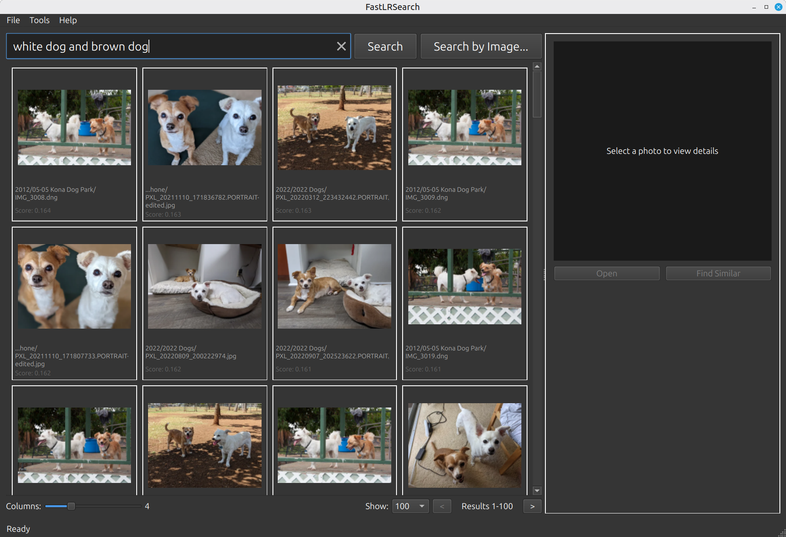

# FastLRSearch

Fast offline semantic photo search for large photo libraries. Find photos by describing what you're looking for, or find visually similar images.



## Features

- **Semantic search** - Search by natural language ("sunset at the beach", "people laughing", "red car")
- **Image similarity** - Find visually similar photos by drag & drop or clicking "Find Similar"
- **Lightroom Classic integration** - Search directly from Lightroom via plugin
- **Multilingual** - Search in English, Japanese, Chinese, and other languages (SigLIP 2 is multilingual)
- **RAW support** - Indexes CR2, CR3, DNG, NEF, ARW, RAF, RW2, ORF alongside JPG/PNG/WebP
- **Offline & private** - Everything runs locally, no cloud services required
- **Smart RAW+JPEG handling** - Automatically skips JPEGs when a RAW counterpart exists
- **Large library support** - Designed for 100K+ photos with background indexing

## How It Works

FastLRSearch uses [SigLIP 2](https://huggingface.co/google/siglip2-so400m-patch16-512) to create semantic embeddings for your photos. When you search, your query is converted to an embedding and compared against all indexed photos using vector similarity.

- **Embeddings**: 1152-dimensional vectors from SigLIP 2
- **Vector DB**: Qdrant (embedded mode, no server required)
- **UI**: PySide6 (Qt) native desktop app

## Requirements

- **OS**: Linux, macOS, or Windows
- **Python**: 3.10+
- **GPU**: NVIDIA GPU (CUDA), Apple Silicon (MPS), or CPU fallback
- **RAM**: 8GB+ (16GB recommended for large libraries)
- **Disk**: ~2GB for models + ~1KB per indexed photo

## Installation

### Linux

1. **Install PyTorch with CUDA** (if you have an NVIDIA GPU):
   ```bash
   # Visit https://pytorch.org/get-started/locally/ for your CUDA version
   pip install torch torchvision --index-url https://download.pytorch.org/whl/cu121
   ```

2. **Install FastLRSearch**:
   ```bash
   pip install -e .
   ```

3. **Run**:
   ```bash
   fastlrsearch
   ```

### macOS (Apple Silicon)

1. **Install FastLRSearch**:
   ```bash
   pip install -e .
   ```
   PyTorch with MPS (Metal) support is installed automatically.

2. **(Optional) Install libraw** for RAW file support:
   ```bash
   brew install libraw
   ```

3. **Run**:
   ```bash
   fastlrsearch
   ```

### Windows

1. **Install PyTorch with CUDA** (if you have an NVIDIA GPU):
   ```bash
   # Visit https://pytorch.org/get-started/locally/ for your CUDA version
   pip install torch torchvision --index-url https://download.pytorch.org/whl/cu121
   ```

2. **Install FastLRSearch**:
   ```bash
   pip install -e .
   ```

3. **Run**:
   ```bash
   fastlrsearch
   ```

## Usage

1. **Set photo directory**: Go to Preferences (Ctrl+, or Cmd+, on macOS) and set your photo root directory
2. **Start indexing**: Click "Start Indexing" in Preferences (runs in background)
3. **Search**: Type a description and press Enter, or drag an image to search by similarity

### Keyboard Shortcuts

| Shortcut | Action |
|----------|--------|
| Enter | Search |
| Ctrl+, (Cmd+, on macOS) | Preferences |
| Ctrl+Q (Cmd+Q on macOS) | Quit |

### GPU Auto-Detection

FastLRSearch automatically selects the best available compute device:

| Platform | GPU | Device Used |
|----------|-----|-------------|
| Linux/Windows | NVIDIA (CUDA) | `cuda` |
| macOS | Apple Silicon (M1/M2/M3/M4) | `mps` |
| Any | No GPU | `cpu` |

You can override this by setting `FASTLRSEARCH_DEVICE=cpu` (or `cuda`/`mps`).

## Configuration

Settings are stored in a platform-specific location:

| Platform | Settings Path |
|----------|---------------|
| Linux | `~/.config/fastlrsearch/settings.json` |
| macOS | `~/Library/Application Support/fastlrsearch/settings.json` |
| Windows | `%APPDATA%\fastlrsearch\settings.json` |

### Data Storage

Index data is stored in `<photo_root>/.fastlrsearch/` by default, keeping it portable with your photos. This includes:

- `qdrant/` — vector database (~1KB per photo)
- `index.db` — photo metadata (SQLite)
- `thumbnails/` — 512px WebP thumbnails for fast preview
- `checkpoints/` — resume data for interrupted indexing

To store index data separately, set `data_dir_override` in settings or via `FASTLRSEARCH_DATA_DIR_OVERRIDE` environment variable.

## Lightroom Classic Plugin

FastLRSearch includes a plugin for Adobe Lightroom Classic, allowing you to search photos directly from Lightroom.

See [fastlrsearch.lrplugin/README.md](fastlrsearch.lrplugin/README.md) for installation and usage instructions.

### Quick Start

1. Copy `fastlrsearch.lrplugin` to your Lightroom plugins folder
2. Add it via File > Plug-in Manager
3. Copy the API token from FastLRSearch and paste it in Plugin Manager
4. Use Library > Plug-in Extras > Search Photos or Find Similar

## Development

```bash
# Install with dev dependencies
pip install -e ".[dev]"

# Type checking
pyright src/

# Format
black src/

# Lint
ruff check src/
```

## License

MIT
